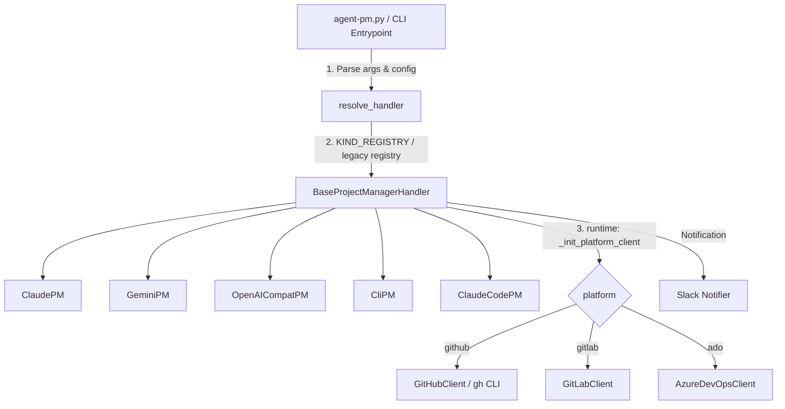

# AGENT_PM システム設計書

## 1. 全体アーキテクチャ

AGENT_PMシステムは、「マルチAIツール×マルチプラットフォーム」を可能にするため、共通のインターフェースを持つプラグイン（ハンドラー）構造を採用します。

- **プロバイダ（AI）** は `BaseProjectManagerHandler` のサブクラス（`ClaudePM` / `GeminiPM` / `OpenAiCompatPM` / `CliPM` / `ClaudeCodePM`・`CodexPM` は既定ハンドラ経由）で、`_call_llm_provider` 経由で推論。`KIND_REGISTRY`（config `ai_providers.<name>.kind`）または legacy registry（`ai_tool`）で解決。
- **プラットフォーム** は handler に縛られず runtime で解決（`_init_platform_client`）。GitHub / GitLab / Azure DevOps の client を同一インターフェースで扱う。

## 2. ディレクトリ構成

- `config/`: 設定テンプレートおよび実設定ファイル
- `docs/`: システム仕様および設計ドキュメント
- `handlers/`: AI・プラットフォーム別のハンドラー実装（BaseHandlerを継承）
- `utils/`: 通知・分析・共通基底。サブパッケージ `utils/platforms/`（GitHub/GitLab/ADO クライアント）・`utils/resilience/`（retry・circuit breaker）・`utils/llm/`（backend メタ・result cache）に整理
- `agent-pm.py`: メインのエントリポイント

## 3. 拡張戦略

1. **フェーズ1（垂直立ち上げ・達成）**: `Claude` × `GitHub` を完全実装。
2. **フェーズ2（マルチプロバイダ・マルチプラットフォーム）**: プロバイダは config の `kind` 1行で追加（`openai_compat` / `cli` は handler 不要）。プラットフォームは client 1つ + `_init_platform_client` の分岐で追加。

各ハンドラーは `BaseProjectManagerHandler` を継承し、共通の PM ロジック（`start_pm_mode`, `update_gantt`, `create_tasks`, `show_milestones`, `generate_report` 等）を実装します。プロバイダは `_call_llm_provider`、プラットフォームは `self.client`（runtime 解決）へポリモーフィックにアクセスし、エントリポイントからは `<ai-tool> PM <action>` で一様に呼び出されます。
